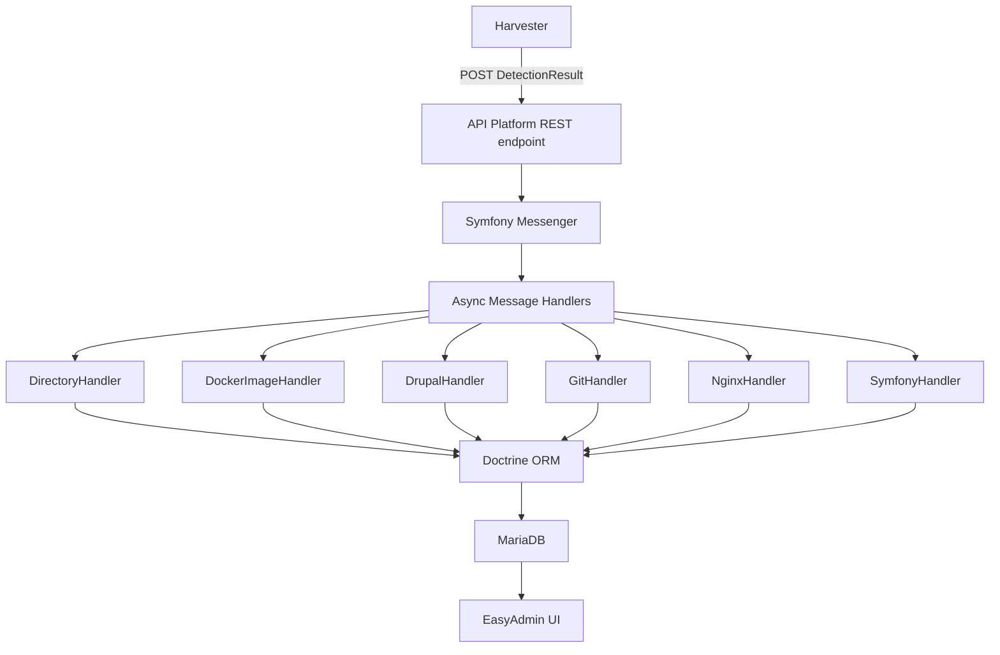

# 🤖 Code Agents - DevOps ITKsites

## Project Overview

**DevOps ITKsites** is an internal Symfony application for server and site
registration/monitoring at ITK Dev. It receives `DetectionResults` from the
[ITK sites server harvester](https://github.com/itk-dev/devops_itkServerHarvest)
and processes them asynchronously to track servers, sites, domains, Docker
images, packages, modules, CVEs, and git repositories.

## Technology Stack

- **Language**: PHP 8.4+ (Symfony 8.1)
- **API**: API Platform 5.0 (REST)
- **Admin UI**: EasyAdmin 5.x
- **Database**: Doctrine ORM 3.x / DBAL 4.x with MariaDB
- **Messaging**: Symfony Messenger (AMQP/RabbitMQ)
- **Auth**: OpenID Connect (`itk-dev/openid-connect-bundle`)
- **Frontend**: Webpack Encore, Stimulus.js
- **Testing**: PHPUnit 13+
- **Code Quality**: PHP-CS-Fixer, PHPStan, Rector

## Architecture



### Key Directories

| Directory               | Purpose                                                                                          |
|-------------------------|--------------------------------------------------------------------------------------------------|
| `src/Entity/`           | ~20 Doctrine entities (Server, Site, Domain, Installation, Package, DockerImage, Advisory, etc.) |
| `src/Handler/`          | DetectionResult handlers (Directory, Docker, Drupal, Git, Nginx, Symfony)                        |
| `src/MessageHandler/`   | Async message processing (PersistDetectionResult, ProcessDetectionResult)                        |
| `src/Controller/Admin/` | EasyAdmin CRUD controllers and the dashboard                                                     |
| `src/Admin/`            | EasyAdmin custom field types (`Field/`) and sort helpers                                         |
| `src/ApiResource/`      | API Platform resource definitions                                                                |
| `src/Service/`          | Factories (PackageVersion, ModuleVersion, Advisory) and export services                          |
| `src/Repository/`       | Doctrine repositories                                                                            |
| `config/packages/`      | Bundle configurations                                                                            |
| `migrations/`           | Doctrine migrations                                                                              |
| `fixtures/`             | Hautelook/Alice test fixtures                                                                    |
| `tests/`                | PHPUnit tests (Api, Controller, MessageHandler)                                                  |

### Data Flow

All analyzed data (sites, installations, domains, packages, etc.) can be
truncated and rebuilt by replaying DetectionResults. Manually maintained data
(Servers, OIDC setups, Service Certificates) is separate and must be preserved.

## Development Environment

```sh
# Start services (MariaDB, PHP-FPM 8.4, Nginx, Mailpit)
docker compose pull && docker compose up --detach

# Install dependencies
docker compose exec phpfpm composer install

# Run migrations
docker compose exec phpfpm bin/console doctrine:migrations:migrate --no-interaction

# Load fixtures
docker compose exec phpfpm composer fixtures

# Login as admin (after fixtures)
docker compose exec phpfpm bin/console itk-dev:openid-connect:login admin@example.com

# Process message queues
docker compose exec phpfpm composer queues

# Build frontend assets
docker compose run --rm node yarn install && docker compose run --rm node yarn build
```

`task` lists the same commands as [Taskfile](Taskfile.yml) tasks.

### Claude Code prerequisites

Install once on the host:

- **jq** (`brew install jq`) - the hooks in `.claude/settings.json` read the
  edited file path with it
- **Intelephense** (`npm install -g intelephense`) - used by the
  `php-lsp` plugin

A session start hook warns when either is missing.

### Hooks

- Edits to lock files, `.env.local`, the exported API spec, the EasyAdmin
  and Mate skills, `vendor/`, `node_modules/` and `var/` are blocked.
- Edited files are formatted with php-cs-fixer, twig-cs-fixer, prettier,
  markdownlint or `composer normalize`.
- PHPStan runs on edited PHP files and `lint:container` runs before stopping;
  errors are reported back.

The hooks skip when the `phpfpm` container is down.

### Symfony AI Mate

[Mate](https://symfony.com/doc/current/ai/components/mate.html) reads logs,
profiler data and the compiled container without booting the app. See
`AGENTS.md` and the `mate-*` skills.

```sh
docker compose exec -T phpfpm vendor/bin/mate tools:list
docker compose exec -T phpfpm vendor/bin/mate tools:call monolog-tail --limit=20
```

The skills, `AGENTS.md` and `mate/AGENT_INSTRUCTIONS.md` are generated. Change
`mate/config.php` or `mate/extensions.php` and run `mate discover`.

### Symfony Language Tools (optional, beta)

[symfony-lsp](https://github.com/symfony/language-tools) reports invalid
routes, service ids, templates, translation keys and config.
`.symfony-lsp.json` runs its PHP in `phpfpm`.

To use it in Claude Code, put the `symfony-lsp` binary from the
[releases](https://github.com/symfony/language-tools/releases) on your `PATH`
and run `/plugin install symfony-lsp@itksites`.

It also works as a one-off check:

```sh
symfony-lsp check src templates config
```

## Quality Checks

All commands run inside Docker containers:

```sh
# PHP coding standards (PHP-CS-Fixer)
docker compose exec phpfpm composer coding-standards-check
docker compose exec phpfpm composer coding-standards-apply

# Rector (check / apply)
docker compose exec phpfpm vendor/bin/rector process --dry-run
docker compose exec phpfpm vendor/bin/rector process

# PHPUnit tests (creates test DB, runs migrations, executes tests)
docker compose exec phpfpm composer tests

# Frontend coding standards
docker compose run --rm node yarn coding-standards-check

# API spec export (must be committed)
docker compose exec phpfpm composer update-api-spec
```

## CI/CD

### GitHub Actions (`pr.yaml`)

Pull requests run these checks:

1. **Composer** (`composer.yaml`) - validates, normalizes, and audits
2. **Doctrine schema validation** (`doctrine.yaml`) - migrations + schema check against MariaDB
3. **PHP-CS-Fixer** (`php.yaml`) - PHP coding standards
4. **PHPStan** (`pr.yaml`) - static analysis (level 6)
5. **Rector** (`pr.yaml`) - fails when Rector would change code
6. **PHPUnit** (`pr.yaml`) - unit/integration tests with MariaDB + coverage
7. **Twig** (`twig.yaml`) - Twig coding standards (twig-cs-fixer)
8. **YAML** (`yaml.yaml`) - YAML formatting (Prettier)
9. **Markdown** (`markdown.yaml`) - Markdown linting (markdownlint)
10. **JavaScript** (`javascript.yaml`) - JS formatting (Prettier)
11. **Styles** (`styles.yaml`) - CSS/SCSS formatting (Prettier)
12. **API spec** (`api-spec.yaml`) - ensures exported OpenAPI spec is up to date
13. **Fixtures** (`doctrine.yaml`) - verifies fixtures load successfully
14. **Asset build** (`pr.yaml`) - verifies frontend assets compile
15. **EasyAdmin skill** (`pr.yaml`) - ensures the committed skill matches the installed EasyAdmin
16. **AI Mate files** (`pr.yaml`) - ensures `mate discover` leaves the committed files unchanged
17. **Changelog** (`changelog.yaml`) - ensures CHANGELOG.md is updated

### Woodpecker CI (deployment)

- `stg.yml` - Deploys to staging on push to develop
- `prod.yml` - Deploys to production on release (Ansible playbook, runs migrations + transport setup)

## PR Guidelines

- PRs must link to a ticket
- Code must pass all CI checks (tests, coding standards, static analysis)
- CHANGELOG.md must be updated
- UI changes require screenshots
- Base branch: `develop`

## Important Conventions

- Entity classes extend `AbstractBaseEntity` (provides `id`, `createdAt`, `updatedAt`)
- Detection handlers implement `DetectionResultHandlerInterface`
- Handlers are auto-tagged and injected via tagged iterator in `services.yaml`
- Async processing uses Symfony Messenger with AMQP transport
- Console commands are named `app:<group>:<action>`, e.g. `app:data:purge`
- Environment-specific config goes in `.env.local` (not committed)
- API specs (`public/api-spec-v1.yaml` and `.json`) must be regenerated and committed when API changes

<easyadmin-guidelines>
This project uses EasyAdmin 5.6.0.

Before creating or modifying admin dashboards, CRUD controllers, fields, actions,
filters or their tests, read and follow the `easyadmin` skill at `.claude/skills/easyadmin/SKILL.md`.

Prefer the makers (`make:admin:dashboard`, `make:admin:crud`) to generate the
initial classes instead of writing them from scratch.

Team conventions for EasyAdmin, if any, are in the `## EasyAdmin conventions`
section of this file, outside this block.
</easyadmin-guidelines>

<!-- BEGIN AI_MATE_AGENTS_IMPORT -->
@AGENTS.md
<!-- END AI_MATE_AGENTS_IMPORT -->
