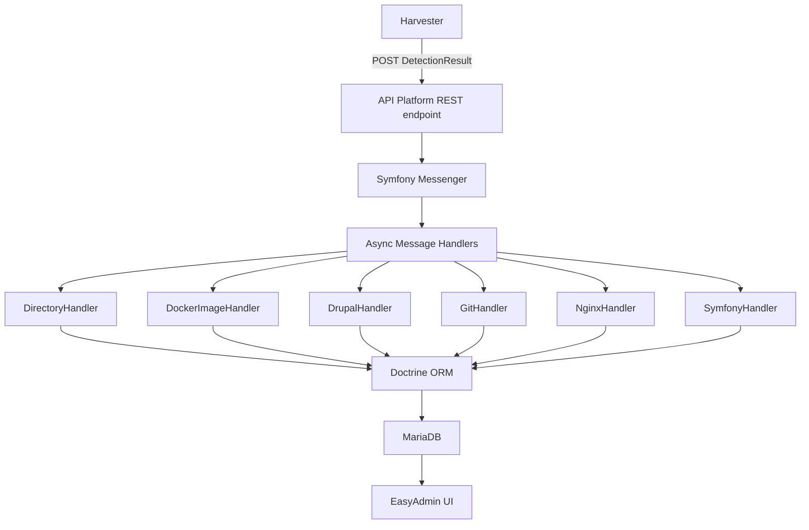

# 🤖 Code Agents - DevOps ITKsites

## Project Overview

**DevOps ITKsites** is an internal Symfony application for server and site
registration/monitoring at ITK Dev. It receives `DetectionResults` from the
[ITK sites server harvester](https://github.com/itk-dev/devops_itkServerHarvest)
and processes them asynchronously to track servers, sites, domains, Docker
images, packages, modules, CVEs, and git repositories.

## Technology Stack

- **Language**: PHP 8.5+ (Symfony 8.0)
- **API**: API Platform 4.0 (REST)
- **Admin UI**: EasyAdmin 5.x
- **Database**: Doctrine ORM 3.x / DBAL 4.x with MariaDB
- **Messaging**: Symfony Messenger (AMQP/RabbitMQ)
- **Auth**: OpenID Connect (`itk-dev/openid-connect-bundle`)
- **Frontend**: Webpack Encore, Stimulus.js
- **Testing**: PHPUnit 13+
- **Code Quality**: PHP-CS-Fixer, PHPStan, Rector

## Architecture



### Key Directories

| Directory             | Purpose                                                                                          |
|-----------------------|--------------------------------------------------------------------------------------------------|
| `src/Entity/`         | ~20 Doctrine entities (Server, Site, Domain, Installation, Package, DockerImage, Advisory, etc.) |
| `src/Handler/`        | DetectionResult handlers (Directory, Docker, Drupal, Git, Nginx, Symfony)                        |
| `src/MessageHandler/` | Async message processing (PersistDetectionResult, ProcessDetectionResult)                        |
| `src/Admin/`          | EasyAdmin CRUD controllers                                                                       |
| `src/ApiResource/`    | API Platform resource definitions                                                                |
| `src/Service/`        | Factories (PackageVersion, ModuleVersion, Advisory) and export services                          |
| `src/Repository/`     | Doctrine repositories                                                                            |
| `config/packages/`    | Bundle configurations                                                                            |
| `migrations/`         | Doctrine migrations                                                                              |
| `fixtures/`           | Hautelook/Alice test fixtures                                                                    |
| `tests/`              | PHPUnit tests (Api, Controller, MessageHandler)                                                  |

### Data Flow

All analyzed data (sites, installations, domains, packages, etc.) can be
truncated and rebuilt by replaying DetectionResults. Manually maintained data
(Servers, OIDC setups, Service Certificates) is separate and must be preserved.

## Development Environment

```sh
# Start services (MariaDB, PHP-FPM 8.5, Nginx, Mailpit)
docker compose pull && docker compose up --detach

# Install dependencies
docker compose exec phpfpm composer install

# Run migrations
docker compose exec phpfpm bin/console doctrine:migrations:migrate --no-interaction

# Load fixtures
docker compose exec phpfpm composer fixtures

# Login as admin (after fixtures)
docker compose exec phpfpm bin/console itk-dev:openid-connect:login admin@example.com

# Process message queues
docker compose exec phpfpm composer queues

# Build frontend assets
docker compose run --rm node yarn install && docker compose run --rm node yarn build
```

## Quality Checks

All commands run inside Docker containers:

```sh
# PHP coding standards (PHP-CS-Fixer)
docker compose exec phpfpm composer coding-standards-check
docker compose exec phpfpm composer coding-standards-apply

# PHPUnit tests (creates test DB, runs migrations, executes tests)
docker compose exec phpfpm composer tests

# Frontend coding standards
docker compose run --rm node yarn coding-standards-check

# API spec export (must be committed)
docker compose exec phpfpm composer update-api-spec
```

## CI/CD

### GitHub Actions (`pr.yaml`)

Pull requests run these checks:

1. **Composer** (`composer.yaml`) - validates, normalizes, and audits
2. **Doctrine schema validation** (`pr.yaml`) - migrations + schema check against MariaDB
3. **PHP-CS-Fixer** (`php.yaml`) - PHP coding standards
4. **PHPStan** (`pr.yaml`) - static analysis (level 6)
5. **PHPUnit** (`pr.yaml`) - unit/integration tests with MariaDB + coverage
6. **Twig** (`twig.yaml`) - Twig coding standards (twig-cs-fixer)
7. **YAML** (`yaml.yaml`) - YAML formatting (Prettier)
8. **Markdown** (`markdown.yaml`) - Markdown linting (markdownlint)
9. **JavaScript** (`javascript.yaml`) - JS formatting (Prettier)
10. **Styles** (`styles.yaml`) - CSS/SCSS formatting (Prettier)
11. **API spec** (`api-spec.yaml`) - ensures exported OpenAPI spec is up to date
12. **Fixtures** (`pr.yaml`) - verifies fixtures load successfully
13. **Asset build** (`pr.yaml`) - verifies frontend assets compile
14. **Changelog** (`changelog.yaml`) - ensures CHANGELOG.md is updated

### Woodpecker CI (deployment)

- `stg.yml` - Deploys to staging on push to develop
- `prod.yml` - Deploys to production on release (Ansible playbook, runs migrations + transport setup)

## PR Guidelines

- PRs must link to a ticket
- Code must pass all CI checks (tests, coding standards, static analysis)
- CHANGELOG.md must be updated
- UI changes require screenshots
- Base branch: `develop`

## Important Conventions

- Entity classes extend `AbstractBaseEntity` (provides `id`, `createdAt`, `updatedAt`)
- Detection handlers implement `DetectionResultHandlerInterface`
- Handlers are auto-tagged and injected via tagged iterator in `services.yaml`
- Async processing uses Symfony Messenger with AMQP transport
- Environment-specific config goes in `.env.local` (not committed)
- API specs (`public/api-spec-v1.yaml` and `.json`) must be regenerated and committed when API changes
